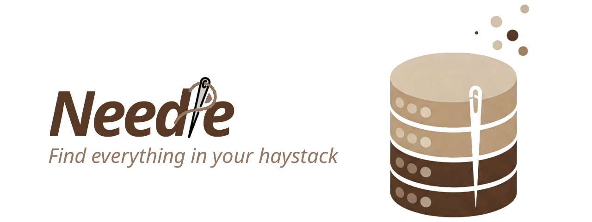

# 🪡 Needle: A Database for Image Content Retrieval

<p align="center">
  
</p>

<p align="center">
  <a href="https://uic-indexlab.github.io/Needle/overview.html">
    
  </a>
  <a href="https://arxiv.org/abs/2412.00639">
    
  </a>
  <a href="https://www.youtube.com/watch?v=n-SXX_ry9-0&t=122s">
    
  </a>
  <a href="https://uic-indexlab.github.io/Needle/demo/">
    
  </a>
</p>


Needle is a deployment-ready system for Image retrieval, designed to empower researchers and developers with a powerful tool for querying **images** using natural language descriptions. It’s based on the research presented in [our paper](https://arxiv.org/abs/2412.00639), introducing a novel approach to efficient and scalable retrieval.

🚀 **Why Needle?**
- Seamlessly retrieve image content from large datasets.
- Extendable and modular design to fit various research needs.
- Backed by cutting-edge research for accurate and robust retrieval.
- 200% improvement over CLIP from OpenAI 

---

## 🎥 Demonstration

Watch as Needle transforms natural language queries into precise image retrieval results in real time.

<p align="center">
    
</p>

## 🎨 Interactive Demo

Try Needle's capabilities with our interactive demo! Experience the complete workflow from text queries to image retrieval.

<div align="center">
  <a href="https://uic-indexlab.github.io/Needle/demo/" target="_blank">
    
  </a>
</div>

**What you'll experience:**
- 🖼️ **Image Generation**: AI-generated images from text prompts
- 🔍 **Similarity Search**: Find similar images from curated datasets  
- ⚡ **Real-time Results**: See performance metrics and timing
- 🎛️ **Full Interface**: Explore all Needle features in a demo environment

---

## ⚙️ Installation

Needle uses a unified installation system that sets up two virtual environments (backend and image generator hub) with Docker infrastructure services.

### 🚀 One-Liner Installation (Recommended)

Install Needle with a single command - no cloning required:

```bash
# Interactive installation (download first, then run)
curl -fsSL https://raw.githubusercontent.com/UIC-InDeXLab/Needle/main/scripts/install-oneliner.sh -o install-needle.sh
bash install-needle.sh

# Or one-liner with specific configuration (non-interactive)
curl -fsSL https://raw.githubusercontent.com/UIC-InDeXLab/Needle/main/scripts/install-oneliner.sh | bash -s fast
curl -fsSL https://raw.githubusercontent.com/UIC-InDeXLab/Needle/main/scripts/install-oneliner.sh | bash -s balanced
curl -fsSL https://raw.githubusercontent.com/UIC-InDeXLab/Needle/main/scripts/install-oneliner.sh | bash -s accurate

# Or one-liner with default configuration (fast)
curl -fsSL https://raw.githubusercontent.com/UIC-InDeXLab/Needle/main/scripts/install-oneliner.sh | bash
```

### 🛠️ Manual Installation

```bash
# Clone the repository
git clone https://github.com/UIC-InDeXLab/Needle.git
cd Needle

# Run the unified installer
chmod +x scripts/install.sh
./scripts/install.sh

# Start all services
./start-needle.sh
```

### ⚙️ Configuration Options

Choose your performance configuration:

- **Fast** (Default): Single CLIP model, fastest indexing and retrieval
- **Balanced**: 4 models with balanced performance and accuracy  
- **Accurate**: 6 models with highest accuracy but slower performance

```bash
# Install with specific configuration
./scripts/install.sh fast          # Fast mode
./scripts/install.sh balanced      # Balanced mode  
./scripts/install.sh accurate      # Accurate mode

# Or using Make
make install-fast
make install-balanced
make install-accurate
```

### 🛠️ Using needlectl (Recommended)

After installation, you can use the `needlectl` command to manage services:

```bash
# Start all services
needlectl service start

# Stop all services
needlectl service stop

# Check status
needlectl service status

# View logs
needlectl service log backend
needlectl service log image-generator-hub
needlectl service log infrastructure

# Restart services
needlectl service restart
```

### 🛠️ Using Make Commands

```bash
# Install Needle (interactive)
make install

# Install with specific configuration
make install-fast
make install-balanced
make install-accurate

# Start all services
make start

# Stop all services
make stop

# Check status
make status

# Development mode
make dev
```

**Architecture:**
- **Backend**: Python virtual environment with direct GPU access
- **Image Generator Hub**: Python virtual environment
- **Infrastructure**: Docker containers (PostgreSQL, Milvus, MinIO, etcd)
- **Cross-Platform**: Works on Linux and macOS with automatic GPU detection

For detailed setup instructions, see [README_UNIFIED.md](README_UNIFIED.md).

## 🏭 Production

To launch the production stack, use the unified installation and start services:
```bash
# Install with your preferred configuration
./scripts/install.sh balanced  # or fast, accurate

# Start all services
./start-needle.sh
# or
needlectl service start
```

## 🛠️ Development
You can start the infrastructure services and launch the backend in hot-reload dev mode with one command:

```bash
make dev
```

This runs infrastructure services in detached mode, then starts the backend with hot reload enabled.

For full production-like setup:

```bash
make install
make start
```

### 📄 Documentation 

Checkout [Needle documentation](https://www.cs.uic.edu/~indexlab/Needle/) to learn more about Needle CLI and its capabilities.


## 📚 Reference

Needle is developed as part of the research presented in our paper:
- [**Needle: A Generative-AI Powered Monte Carlo Method for Answering Complex Natural Language Queries on Multi-modal Data**](https://arxiv.org/abs/2412.00639)

If you use Needle in your work, please cite our paper to support the project:

```bibtex  
@article{erfanian2024needle,
  title={Needle: A Generative-AI Powered Monte Carlo Method for Answering Complex Natural Language Queries on Multi-modal Data},
  author={Erfanian, Mahdi and Dehghankar, Mohsen and Asudeh, Abolfazl},
  journal={arXiv preprint arXiv:2412.00639},
  year={2024}
}
```  

---  

## 🌟 Contributions & Feedback

We welcome contributions, feedback, and discussions! Feel free to open issues or submit pull requests in our [GitHub repository](https://github.com/UIC-InDeXLab/Needle).

Let’s build the future of multimodal content retrieval together!

---
