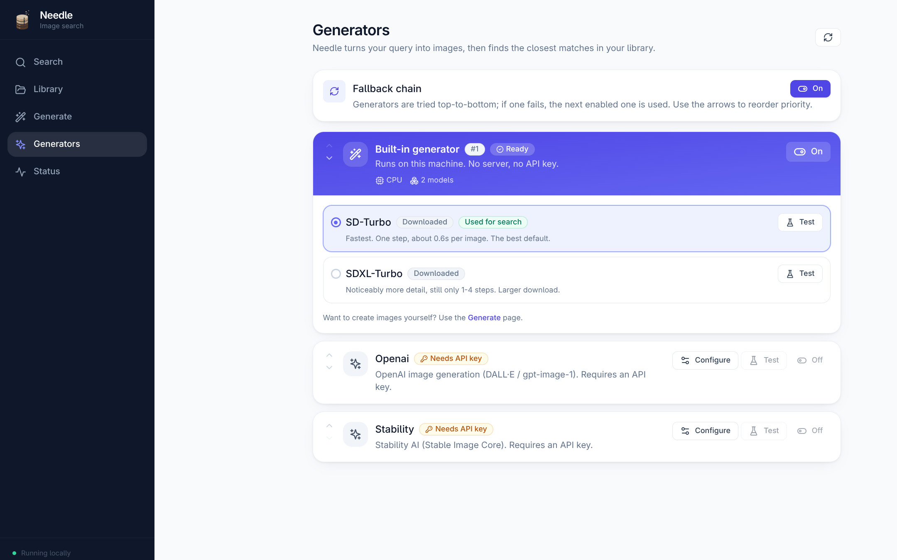
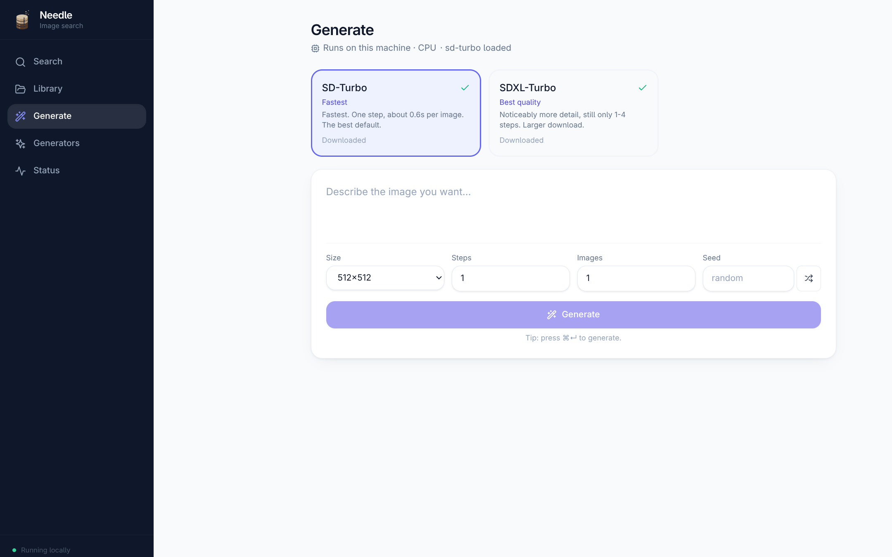

# Image Generation

Needle answers a query by turning your words into images and then finding the
closest matches in your library, so generation is part of normal search. The
**Generate** tab exposes the same engine directly, so you can create images
yourself.

## Built-in generator

Generation runs **in-process, on your machine** — no companion service, no
server to start, and no API key. It uses the GPU (Apple Silicon MPS, or CUDA)
when hardware acceleration is enabled.

Model weights are **not bundled with the app** and are never downloaded behind
your back. Pick a model and press **Download**; Needle shows live progress and
the engine only becomes available once the weights are on disk. Until then the
built-in generator reads as *off*, and search will tell you what is missing
rather than quietly pulling several gigabytes.

| Model | Download | Steps | Notes |
| --- | --- | --- | --- |
| **SD-Turbo** (default) | 2.6 GB | 1 | Fastest — roughly 0.6 s per 512px image on an M3 Pro |
| **SDXL-Turbo** | 6.9 GB | 2 | More detail, at 512–1024px |

You only need one. Start with SD-Turbo; add SDXL-Turbo later if you want more
detail. Weights live in the shared Hugging Face cache, so other tools on your
machine can reuse them (and the [Status](status.md) page reports how much space
they take).

Both are *step-distilled*: they produce an image in 1–4 denoising steps instead
of the usual 25–50, which is what makes local generation fast enough to sit
inside a search. Smaller non-distilled models exist, but they still need ~25
steps and end up slower despite being smaller.

Needle requests the **fp16** weights, which halves the download compared with
full-precision files that would only be cast down on load anyway.

## Generating images

Search generates query images for you automatically. The **Generate** tab is
there for when you want to create images yourself.

- **Prompt** — describe the image; press <kbd>⌘</kbd><kbd>↵</kbd> to run.
- **Size** — the sizes each model was trained for.
- **Steps** — more steps is slower and, for turbo models, rarely better.
- **Images** — generate up to 8 at once; batching is cheaper per image.
- **Seed** — fix it to reproduce a result, or leave blank for a random one.

Each result shows the time per image and the seed used, and can be saved to a
folder of your choice.

## Memory

A loaded pipeline holds several GB. On Apple Silicon that memory is shared with
the search models and everything else on the machine, and spilling into swap
costs far more than reloading does. Needle therefore **unloads the generation
model after 5 minutes idle** and reloads it from the local cache on next use.

If generation ever feels drastically slower than the figures above, check
whether the machine is swapping rather than assuming the GPU is at fault.

## Cloud providers

**OpenAI** and **Stability AI** can be used instead of, or alongside, the
built-in engine. Add an API key under **Generators → Configure**.

Engines are tried top to bottom in the list. With **Fallback chain** on, a
failing engine hands off to the next enabled one; with it off, only the first
enabled engine is used. Reorder priority with the arrows next to each engine.

Use **Test** on any engine to generate a single throwaway image. It confirms the
engine works (and warms the model, so your first real search is fast) without
committing to a full search.

> Cloud providers send your query text to a third party. The built-in generator
> does not — with it, nothing leaves your machine.
