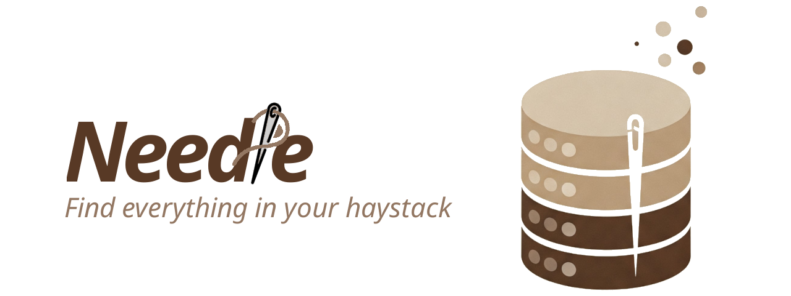

<!-- Needle Banner -->


<!-- Motto -->
*We have found the* ***Needle*** *in haystack!* 🪡🔍

<!-- Description -->
Needle is an open-source image retrieval database with high accuracy that can easily handle complex queries in natural language. It is **Fast**, **Efficient**, and **Precise**, outperforming state-of-the-art methods. Born from high-end research, Needle is designed to be accessible to everyone while delivering top-notch performance. Whether you’re a researcher, developer, or an enthusiast, Needle opens up innovative ways to explore your image datasets. ✨

<!-- Demonstration GIF -->
## See Needle in Action

<video controls>
  <source src="media/needle-demo.mp4" type="video/mp4">
</video>

*Watch as Needle transforms natural language queries into precise image retrieval results in real time.*


## Comparison to State-of-the-Art Methods
Curious how Needle measures up against other cutting-edge approaches? Here, you'll soon find performance plots that compare Needle with OPEN-AI CLIP image retrieval method for LVIS, Caltech256 and BDD100k.   

<!DOCTYPE html>
<html lang="en">
<head>
    <meta charset="UTF-8">
    <meta name="viewport" content="width=device-width, initial-scale=1.0">
    <script src="https://cdnjs.cloudflare.com/ajax/libs/Chart.js/3.7.0/chart.min.js"></script>
    <style>
        .tabs {
            display: flex;
            margin-bottom: 10px;
            border-bottom: 2px solid #e0e0e0;
        }
        .tab-button {
            padding: 10px 20px;
            cursor: pointer;
            border: none;
            background: none;
            outline: none;
            font-size: 16px;
        }
        .tab-button.active {
            border-bottom: 2px solid #007acc;
            font-weight: bold;
        }
    </style>
    <title>Mean Average Precision Charts</title>
</head>
<body>
    <div class="tabs">
        <button class="tab-button active" id="allQueriesTab">All Queries</button>
        <button class="tab-button" id="hardQueriesTab">Hard Queries</button>
    </div>

    <div id="chartContainer">
        <div style="background: white; border-radius: 8px; padding: 20px; box-shadow: 0 1px 3px rgba(0,0,0,0.12);">
            <h3 id="chartTitle">Mean Average Precision Across Datasets (All Queries)</h3>
            <div style="height: 400px;">
                <canvas id="precisionChart"></canvas>
            </div>
        </div>
    </div>

    <script>
        document.addEventListener('DOMContentLoaded', function () {
            const allQueriesData = {
                labels: ['LVIS', 'Caltech256', 'BDD100K', 'COCO'],
                 datasets: [
                {
                    label: 'Needle',
                    data: [0.323, 0.966, 0.711, 0.977],
                    backgroundColor: '#4caf50',
                    borderColor: '#2e7d32',
                    borderWidth: 1
                },
                {
                    label: 'CLIP',
                    data: [0.168, 0.939, 0.670, 0.952],
                    backgroundColor: '#2196f3',
                    borderColor: '#1565c0',
                    borderWidth: 1
                },
                {
                    label: 'ALIGN',
                    data: [0.207, 0.947, 0.573, 0.960],
                    backgroundColor: '#ff9800',
                    borderColor: '#ef6c00',
                    borderWidth: 1
                },
                {
                    label: 'FLAVA',
                    data: [0.180, 0.903, 0.698, 0.941],
                    backgroundColor: '#9c27b0',
                    borderColor: '#6a1b9a',
                    borderWidth: 1
                },
                {
                    label: 'BLIP + MiniLM',
                    data: [0.179, 0.838, 0.610, 0.951],
                    backgroundColor: '#e91e63',
                    borderColor: '#c2185b',
                    borderWidth: 1
                }
            ]
            };

            const hardQueriesData = {
                labels: ['LVIS', 'Caltech256', 'BDD100K', 'COCO'],
                 datasets: [
                {
                    label: 'Needle',
                    data: [0.249, 0.687, 0.158, 0.981],
                    backgroundColor: '#4caf50',
                    borderColor: '#2e7d32',
                    borderWidth: 1
                },
                {
                    label: 'CLIP',
                    data: [0.078, 0.181, 0.005, 0.477],
                    backgroundColor: '#2196f3',
                    borderColor: '#1565c0',
                    borderWidth: 1
                },
                {
                    label: 'ALIGN',
                    data: [0.129, 0.398, 0.003, 0.895],
                    backgroundColor: '#ff9800',
                    borderColor: '#ef6c00',
                    borderWidth: 1
                },
                {
                    label: 'FLAVA',
                    data: [0.099, 0.306, 0.036, 0.281],
                    backgroundColor: '#9c27b0',
                    borderColor: '#6a1b9a',
                    borderWidth: 1
                },
                {
                    label: 'BLIP + MiniLM',
                    data: [0.107, 0.372, 0.144, 0.698],
                    backgroundColor: '#e91e63',
                    borderColor: '#c2185b',
                    borderWidth: 1
                }
            ]
            };

            const ctx = document.getElementById('precisionChart').getContext('2d');
            let precisionChart = new Chart(ctx, {
                type: 'bar',
                data: allQueriesData,
                options: {
                    responsive: true,
                    maintainAspectRatio: false,
                    plugins: {
                        tooltip: {
                            callbacks: {
                                label: function (context) {
                                    return context.dataset.label + ': ' + context.raw;
                                }
                            }
                        }
                    },
                    scales: {
                        y: {
                            beginAtZero: true,
                            title: {
                                display: true,
                                text: 'Mean Average Precision'
                            }
                        }
                    }
                }
            });

            const allQueriesTab = document.getElementById('allQueriesTab');
            const hardQueriesTab = document.getElementById('hardQueriesTab');
            const chartTitle = document.getElementById('chartTitle');

            allQueriesTab.addEventListener('click', function () {
                allQueriesTab.classList.add('active');
                hardQueriesTab.classList.remove('active');
                chartTitle.textContent = 'Mean Average Precision Across Datasets (All Queries)';
                precisionChart.data = allQueriesData;
                precisionChart.update();
            });

            hardQueriesTab.addEventListener('click', function () {
                hardQueriesTab.classList.add('active');
                allQueriesTab.classList.remove('active');
                chartTitle.textContent = 'Mean Average Precision Across Datasets (Hard Queries)';
                precisionChart.data = hardQueriesData;
                precisionChart.update();
            });
        });
    </script>
</body>
</html>

<!-- Call to Action -->
## Get Started Today!
Ready to revolutionize your image retrieval process? 🚀  
Install and test Needle now to experience the future of multimodal search!

> **Tip:** For detailed installation instructions, check out the [Getting Started](getting-started.md) section.

## Cite us 

For a deep dive into Needle’s theoretical guarantees and performance insights, please refer to our research paper.
- [**Needle: A Generative-AI Powered Monte Carlo Method for Answering Complex Natural Language Queries on Multi-modal Data**](https://arxiv.org/abs/2412.00639)

If you find Needle beneficial for your work, we kindly ask that you cite our work to help support continued innovation.

```bibtex  
@article{erfanian2024needle,
  title={Needle: A Generative-AI Powered Monte Carlo Method for Answering Complex Natural Language Queries on Multi-modal Data},
  author={Erfanian, Mahdi and Dehghankar, Mohsen and Asudeh, Abolfazl},
  journal={arXiv preprint arXiv:2412.00639},
  year={2024}
}
```  
