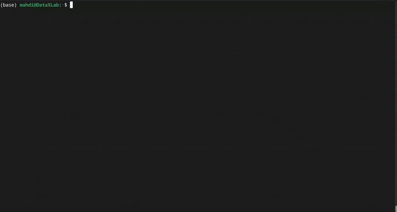

<!-- Needle Banner -->

<!-- Motto -->
*We have found the* ***Needle*** *in haystack!* 🪡🔍

<!-- Description -->
Needle is an image retrieval database with high accuracy that can easily handle complex queries in natural language. It is **Fast**, **Efficient**, and **Precise**, outperforming state-of-the-art methods. Born from high-end research, Needle is designed to be accessible to everyone while delivering top-notch performance. Whether you’re a researcher, developer, or an enthusiast, Needle opens up innovative ways to explore your image datasets. ✨

<!-- Demonstration GIF -->
## See Needle in Action

*Watch as Needle transforms natural language queries into precise image retrieval results in real time.*

<!-- Call to Action -->
## Get Started Today!
Ready to revolutionize your image retrieval process? 🚀  
Install and test Needle now to experience the future of multimodal search!

> **Tip:** For detailed installation instructions, check out the [Getting Started](getting-started.md) section.

---