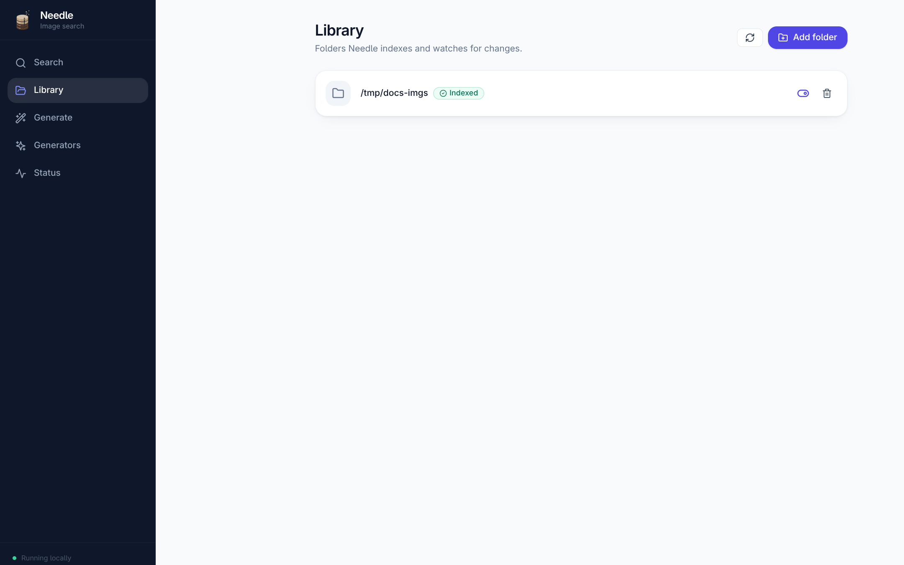
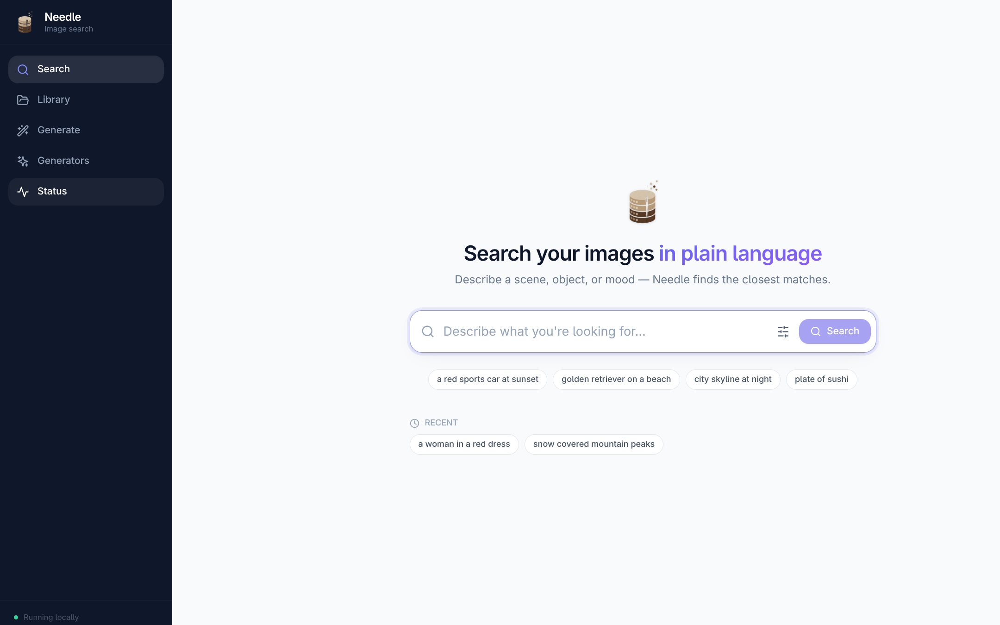
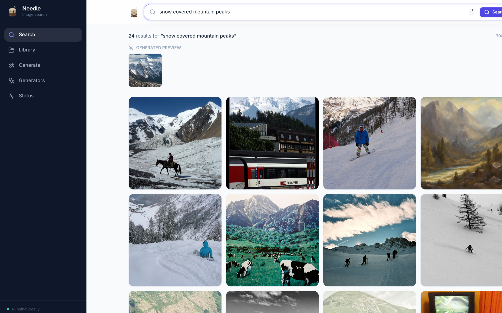

# Searching Your Images

Needle searches your photos the way you'd describe them to a person. Type
*"snow covered mountain peaks"* and you get the closest matches from your own
folders — no tags, no filenames, no manual organising.

## How it works

Needle does not try to match your words against text. Instead it:

1. **Generates** a small preview image from your query.
2. **Embeds** that preview with the same models used to index your library.
3. **Retrieves** the images whose embeddings sit closest to it.

Because both sides of the comparison are images, the match is based on what
things actually *look* like. That's why the query image is shown alongside your
results — it tells you exactly what Needle went looking for.

Everything runs on your machine. Your photos are never uploaded.

## 1. Add a folder

Open **Library** and choose **Add folder**. Pick any folder of images; Needle
indexes it and then keeps watching it for changes.

Indexing shows live progress. Once a folder is indexed, Needle keeps it in sync
automatically:

- New images are picked up and indexed.
- Deleted images drop out of your results.
- Renamed or moved images follow their new path.

You can pause a folder with the toggle (it stays indexed but is excluded from
searches) or remove it entirely with the trash icon, which also deletes the
data Needle stored for it.

By default Needle indexes the files directly inside the folder you pick. Turn on
recursive indexing to include subfolders as well.

Supported formats: JPEG, PNG, WebP, BMP, GIF and TIFF.

## 2. Search

Open **Search** and describe what you're looking for.

Needle generates the query image, then ranks your library against it. Results
appear as a grid, with the generated preview shown above them.

Click any result to open it full size, where you can step through the set with
the arrow keys and download the original.

## Tuning a search

The slider icon in the search bar opens the options:

| Option | What it does |
|---|---|
| **Results** | How many images to return. |
| **Images to generate** | How many query images to generate. More images broaden the search and can improve recall, at the cost of speed. |
| **Generated size** | Resolution of the query image. Larger is slower, and rarely changes the ranking much. |

## Getting better results

- **Describe the picture, not the subject.** *"a red bus on a cobbled street"*
  works better than *"transport"*.
- **Mention what's visually distinctive** — colours, setting, time of day,
  composition.
- **Try the accurate profile** if results feel loose. It uses more embedding
  models and is noticeably better at fine distinctions, at the cost of indexing
  and search time. You can switch profiles at any time, but changing them means
  re-indexing your library.

## Requirements

Search needs two things before it will run:

1. **At least one indexed folder**, and
2. **A generator that is ready** — by default the built-in one, once a model has
   been downloaded. See [Image Generation](generating.md).

If either is missing, the search box is disabled and Needle links you to the
page that fixes it.
