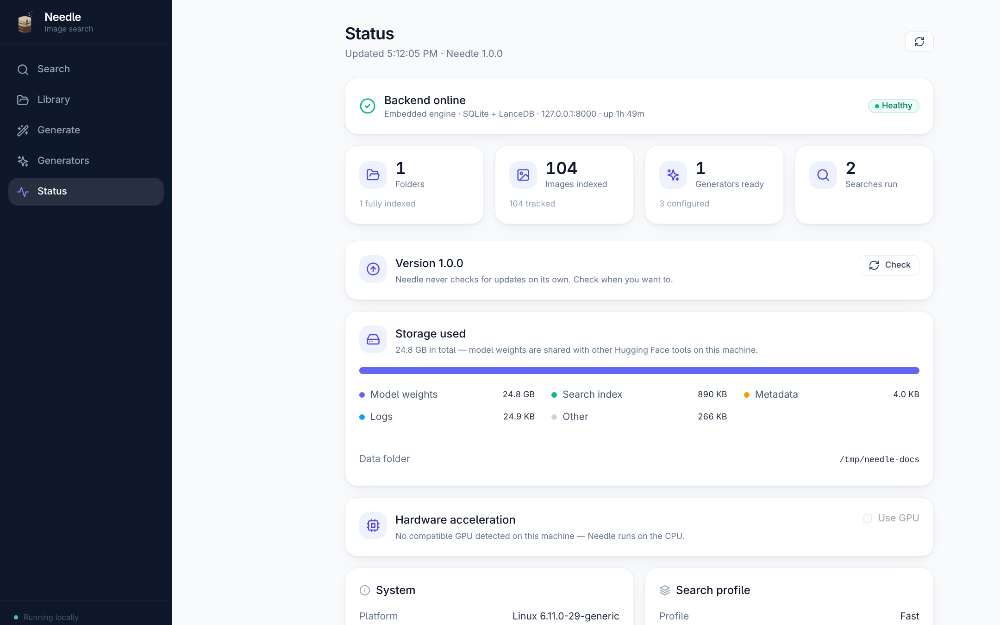

# Status & Settings

The **Status** page is where Needle reports what it is doing, what it is using,
and whether there is a newer version.

## Health and library

The top of the page confirms the local backend is running, and summarises your
library: how many folders are indexed, how many images are tracked and indexed,
how many generators are ready, and how many searches you've run.

## Version and updates

Needle **never checks for updates on its own** — nothing is sent anywhere unless
you ask. Press **Check** to compare your version against the published releases.
If a newer one exists, Needle shows the release notes and a link to download it.

Updating is a normal install of the new package over the old one. Your library,
index and settings live outside the app and are left untouched.

## Storage

Needle breaks down what it is using on disk:

| Item | What it is |
|---|---|
| **Model weights** | Embedding and generation models, in the shared Hugging Face cache |
| **Search index** | The vector index (LanceDB) |
| **Metadata** | Which files exist and whether they're indexed (SQLite) |
| **Logs** | Application logs |

Model weights dominate, and they are shared with any other Hugging Face tool on
your machine — so that space is not necessarily Needle's alone. The index itself
is small: a few hundred kilobytes for a hundred images.

## Hardware acceleration

Needle uses your GPU when one is available and usable:

- **Apple Silicon** — the Metal (MPS) backend.
- **NVIDIA** — CUDA, if you installed a CUDA build.
- Otherwise it runs on the CPU, which works fine but is slower.

Toggle **Use GPU** to switch. Needle reloads the models onto the new device;
weights are already cached, so nothing is re-downloaded.

> The published Linux and Windows builds ship a **CPU-only** PyTorch, so they
> report no GPU even on a machine that has one. Building from source with
> `NEEDLE_ACCEL=cuda` produces a CUDA build.

## System and profile

The lower cards report the platform, architecture, the device in use, and the
Python and PyTorch versions — useful when filing a bug report.

**Search profile** shows which accuracy profile is active and which embedding
models it uses:

| Profile | Models | Trade-off |
|---|---|---|
| **fast** | 2 | Quickest to index and search |
| **balanced** | 4 | Middle ground |
| **accurate** | 6 | Best results, slowest, largest download |

You choose a profile on first launch. Changing it later means re-indexing your
library, since the stored vectors belong to the models that produced them.

## Where your data lives

| Platform | Location |
|---|---|
| **Linux** | `~/.local/share/com.needle.app` |
| **macOS** | `~/Library/Application Support/com.needle.app` |
| **Windows** | `%APPDATA%\com.needle.app` |

Model weights are separate, in the Hugging Face cache (`~/.cache/huggingface` on
Linux and macOS). Deleting the data directory resets Needle to a first run
without re-downloading models; see [Uninstallation](uninstallation.md).
